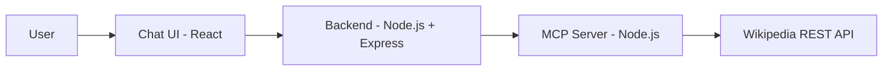

# Wikipedia MCP Chat Application — Project Scope

## Project Overview

**Goal:** Create a user-friendly chat application that allows users to ask questions and retrieve information from Wikipedia.

**Summary:** The system consists of a chat UI where users ask questions, a backend API that connects the UI to a Wikipedia MCP (Model Context Protocol) server, and the MCP server itself, which uses the Wikipedia REST API to fetch data. Users see article summaries and links to full Wikipedia articles in the chat.

---

## Features

- **Chat interface** — Users type questions and receive responses (article summaries and links).
- **Wikipedia MCP server** — Node.js MCP server that exposes tools for retrieving Wikipedia data.
- **Tools:**
  - `search_wikipedia(query)` — Search Wikipedia and return relevant results.
  - `get_article_summary(title)` — Return summary and metadata for a given article title.
- **Backend API** — Connects the chat UI to the MCP server: receives chat requests, invokes MCP tools, and returns results.
- **Wikipedia REST API integration** — Used by the MCP server to perform searches and fetch article summaries.
- **Display** — Show article summary in the UI and provide a link to the full Wikipedia article.

---

## MCP Tools

### search_wikipedia(query)

- **Input:** Search query string.
- **Behavior:** Call the Wikipedia API (e.g. opensearch or search endpoint) and return a list of matching articles (titles, URLs, optional snippets).

### get_article_summary(title)

- **Input:** Article title.
- **Behavior:** Call the Wikipedia API (e.g. summary/extract endpoint) and return the summary text and the canonical URL to the full article.

---

## Architecture

Data flows from the user through the chat UI to the backend, then to the MCP server, and finally to the Wikipedia REST API. The chat UI communicates only with the backend; the backend is the only component that talks to the MCP server; the MCP server is the only component that talks to Wikipedia.

---

## User Flow

1. User opens the chat UI and types a question (e.g. “What is photosynthesis?”).
2. The UI sends the message to the backend API.
3. The backend invokes the MCP server (e.g. `search_wikipedia` then `get_article_summary` for the chosen result, or `get_article_summary` directly if the title is known).
4. The MCP server calls the Wikipedia REST API and returns data to the backend.
5. The backend returns the summary and link to the UI.
6. The UI displays the summary and a link to the full Wikipedia article.

---

## Tech Stack

| Layer | Technology |
|-------|------------|
| **Frontend** | React (chat interface, display summaries and links) |
| **Backend** | Node.js + Express (API layer between UI and MCP server) |
| **MCP Server** | Node.js MCP implementation (exposes `search_wikipedia` and `get_article_summary`) |
| **External API** | Wikipedia REST API (e.g. MediaWiki API / REST API for search and summary) |
